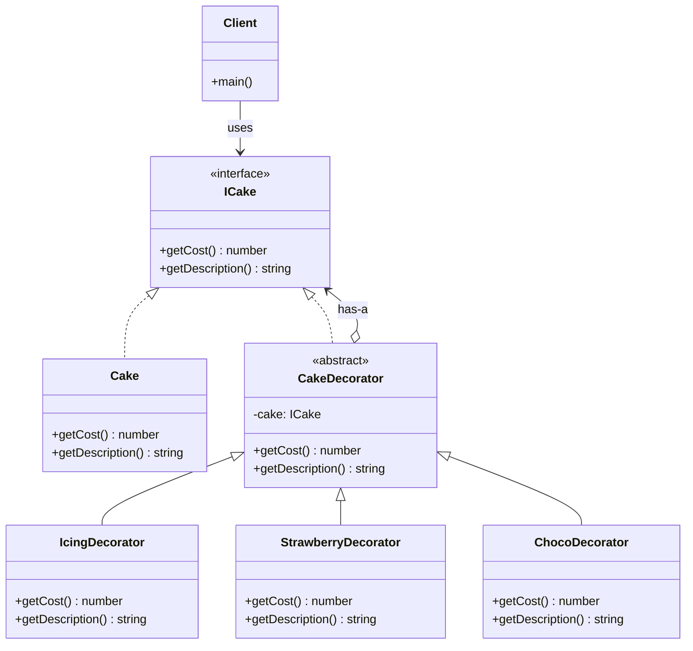

# Decorator Pattern

Add behaviours to objects / classes without modifying it original code

```mermaid
classDiagram

%% Interface
class ICake {
  <<interface>>
  +getCost() number
  +getDescription() string
}

%% Concrete Component
class Cake {
  +getCost() number
  +getDescription() string
}

ICake <|.. Cake

%% Decorator Base
class CakeDecorator {
  <<abstract>>
  -cake: ICake
  +getCost() number
  +getDescription() string
}

ICake <|.. CakeDecorator


%% Concrete Decorators
class IcingDecorator {
  +getCost() number
  +getDescription() string
}

class StrawberryDecorator {
  +getCost() number
  +getDescription() string
}

class ChocoDecorator {
  +getCost() number
  +getDescription() string
}

CakeDecorator <|-- IcingDecorator
CakeDecorator <|-- StrawberryDecorator
CakeDecorator <|-- ChocoDecorator

%% Client
class Client {
  +main()
}

Client --> ICake : uses
CakeDecorator o--> ICake : has-a
```
